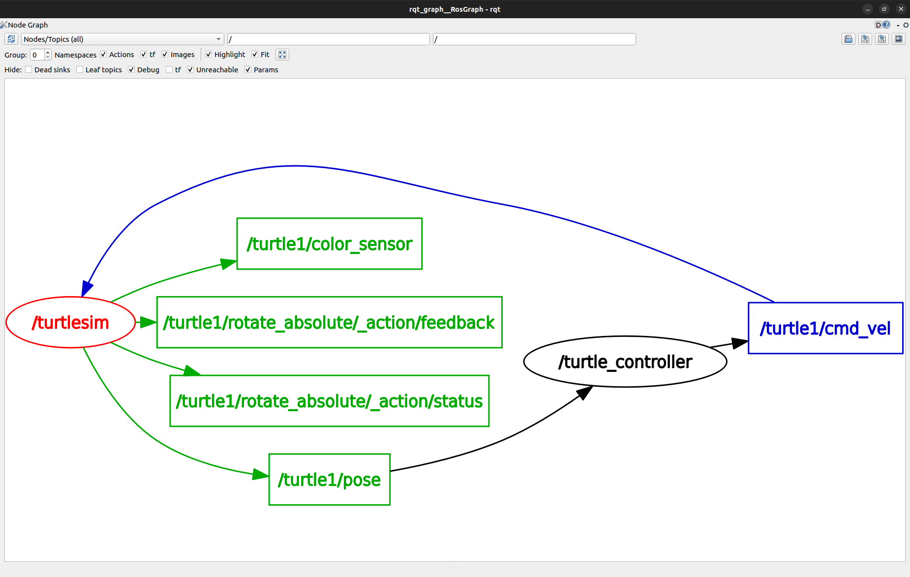
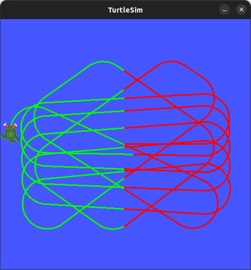

# ROS2 Humble TurtleSim Avoidance

## Project Description and Characteristics

This project focuses on modifying the demo `turtlesim` node in ROS2 to implement autonomous behavior. The custom node commands the turtle to move continuously while actively avoiding collisions with the window boundaries. Additionally, it dynamically changes the color of the turtle's pen trace based on its position on the screen.

This project was realized and expanded upon as part of the **"ROS2 Tutorials - ROS2 Humble for Beginners"** course.

**Full Documentation:** [ROS2_Tutorials_ROS2_Humble_For_Beginners.pdf](docs/ROS2_Tutorials_ROS2_Humble_For_Beginners.pdf)

**Key Characteristics:**
* **Movement Logic:** The turtle moves forward automatically and calculates the distance to the walls. If it approaches a boundary, it rotates to avoid a collision.
* **Dynamic Pen Color:** A ROS2 Service client is utilized to change the pen color (RGB values) when the turtle crosses a specific coordinate (e.g., the vertical center line).
* **Communication:** * **Topics:** Subscribes to `/turtle1/pose` (to monitor current coordinates) and publishes to `/turtle1/cmd_vel` (to send velocity commands).
  * **Services:** Calls the `/turtle1/set_pen` service to alter the drawing properties.

## ROS2 System Graph (rqt_graph)

The communication architecture between the nodes is visualized below. It demonstrates the flow of data where our custom controller node subscribes to the pose data and publishes velocity commands to the simulation node.

## Example Operation

The image below demonstrates the physical result of the algorithm within the `TurtleSim` window. The turtle successfully navigates the environment without hitting the edges, and the color of the drawn path changes depending on its position on the grid.

## Software Implementation

A core component of this project is the custom Python node developed to handle the control loop and service calls:

* **[`turtle_controller.py`](my_robot_controller/turtle_controller.py):** This main script initializes the node, establishes the publishers/subscribers, and processes the logic for wall avoidance. It also handles the asynchronous service calls to change the pen color without blocking the movement loop.

## Software Used
* ROS2 Humble Hawksbill
* Python 3.10
* Ubuntu 22.04 LTS
